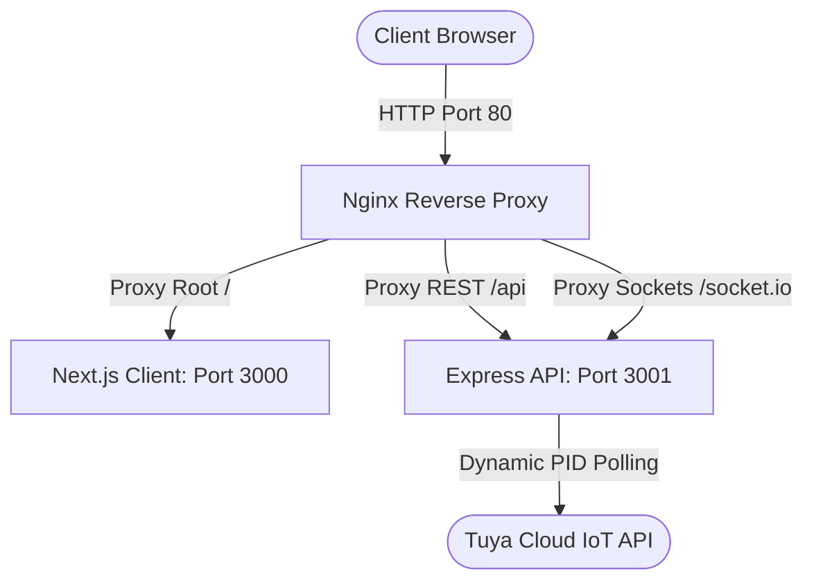

# Elenza Smart Coffee IoT Platform - Production Deployment

This is the central documentation and operational guide for the **Elenza Smart Coffee IoT Platform** production deployment. The monorepo consists of a Next.js (React 18) luxury dashboard frontend and a real-time Node.js/Express socket telemetry backend bridge.

---

## 1. Production Architecture Snapshot



- **Live IP/Host**: `http://54.162.197.40`
- **Frontend Port**: `3000` (Next.js Production Build)
- **Backend Port**: `3001` (Pre-compiled JavaScript Engine)
- **Process Management**: **PM2** Process Manager (Auto-restart, crash recovery, persistence)
- **Reverse Proxy**: **Nginx 1.28** (Maps port 3000 client and port 3001 backend on Port 80)

---

## 2. Server Deployment Details

### 2.1 Virtual Memory Optimization (Swap Space)
To build Next.js production bundles stably without getting OOM-killed (Out-Of-Memory) by the Linux kernel on small 1GB RAM VPS instances, a **2GB swap space** was configured:
```bash
sudo fallocate -l 2G /swapfile
sudo chmod 600 /swapfile
sudo mkswap /swapfile
sudo swapon /swapfile
```

### 2.2 PM2 Process Configurations
Both applications run permanently in the background under PM2:
*   **Express Server**: `elenza-server` (Running `node dist/index.js` inside `/home/ubuntu/elenza/server`)
*   **Next.js Client**: `elenza-client` (Running `npm run start` inside `/home/ubuntu/elenza/client`)

PM2 lists, logs, and processes are persisted across server reboots:
```bash
pm2 status                  # Check running instances
pm2 logs                    # Check aggregated standard/error outputs
pm2 restart all             # Restart both frontend and backend
pm2 save                    # Save configuration to disk for auto-boots
```

### 2.3 Nginx Reverse Proxy Config (Dual Port HTTP/HTTPS SSL)
Located at `/etc/nginx/sites-available/default`, the reverse proxy is calibrated to support both plain text HTTP (Port 80) and secure HTTPS (Port 443) using a self-signed SSL certificate to perfectly support modern browsers that force-upgrade connections to `https://`:
```nginx
server {
    listen 80 default_server;
    listen [::]:80 default_server;
    listen 443 ssl default_server;
    listen [::]:443 ssl default_server;

    ssl_certificate /etc/ssl/certs/nginx-selfsigned.crt;
    ssl_certificate_key /etc/ssl/private/nginx-selfsigned.key;

    server_name _;

    # Frontend Client
    location / {
        proxy_pass http://127.0.0.1:3000;
        proxy_http_version 1.1;
        proxy_set_header Upgrade $http_upgrade;
        proxy_set_header Connection 'upgrade';
        proxy_set_header Host $host;
        proxy_cache_bypass $http_upgrade;
    }

    # REST APIs / Express Backend
    location /api/ {
        proxy_pass http://127.0.0.1:3001/api/;
        proxy_http_version 1.1;
        proxy_set_header Upgrade $http_upgrade;
        proxy_set_header Connection 'upgrade';
        proxy_set_header Host $host;
        proxy_cache_bypass $http_upgrade;
    }

    # Socket.io Live Telemetry
    location /socket.io/ {
        proxy_pass http://127.0.0.1:3001/socket.io/;
        proxy_http_version 1.1;
        proxy_set_header Upgrade $http_upgrade;
        proxy_set_header Connection 'upgrade';
        proxy_set_header Host $host;
        proxy_cache_bypass $http_upgrade;
        proxy_set_header X-Real-IP $remote_addr;
        proxy_set_header X-Forwarded-For $proxy_add_x_forwarded_for;
    }
}
```

---

## 3. Operational & Restart Procedures

If you need to redeploy or restart the stack remotely:

1.  **Connect to the VPS**:
    ```bash
    ssh -i missionx.key ubuntu@54.162.197.40
    ```
2.  **Pull changes & Rebuild Frontend**:
    ```bash
    cd /home/ubuntu/elenza/client
    npm run build
    pm2 restart elenza-client
    ```
3.  **Rebuild Backend**:
    ```bash
    cd /home/ubuntu/elenza/server
    npm run build
    pm2 restart elenza-server
    ```

---

## 4. IMPORTANT NOTE FOR PUBLIC ACCESS (AWS FIREWALL)

The server OS and `ufw` firewalls are completely open, and both applications compile and bind to their respective ports.
To access the live platform remotely from a browser, **you must ensure Port 80 is open in the AWS Security Group**:
1. Open the **AWS EC2 Console**.
2. Select your instance (`54.162.197.40`).
3. Click the **Security** tab and open your active **Security Group**.
4. Add an **Inbound Rule**:
   *   **Type**: `HTTP`
   *   **Port Range**: `80`
   *   **Source**: `Anywhere-IPv4` (`0.0.0.0/0`)

---

## 5. GitHub Connection & Setup Best Practices

To initialize and push changes to GitHub without authentication or connection errors, follow this simple 3-step checklist:

### Step 1: Ensure your identity is set up (usually persistent)
If you ever switch systems or profiles, verify or set your user credentials:
```powershell
git config --global user.name "Zehri"
git config --global user.email "bitcoinsharjah5@gmail.com"
```

### Step 2: Enable the Credential Helper
Ensure Git remembers your logins using Windows' secure storage:
```powershell
git config --global credential.helper manager
```

### Step 3: Pushing a New Repository for the First Time
When creating a new repository, run these exact steps to ensure a smooth, error-free first push:

1. **Initialize Git in the local folder**:
   ```powershell
   git init -b main
   ```
2. **Add your files and commit them**:
   ```powershell
   git add -A
   git commit -m "Initial commit"
   ```
3. **Link your local repository to your remote GitHub repository**:
   ```powershell
   git remote add origin https://github.com/linux2z/Elenza-Tuya-Cloud.git
   ```
4. **Push to remote** (if a login popup appears, simply complete the standard web browser verification once):
   ```powershell
   git push -u origin main
   ```

Because your credentials are tied directly to Windows secure storage, you can freely create, modify, and push your hardware/software files without credential interruptions!
